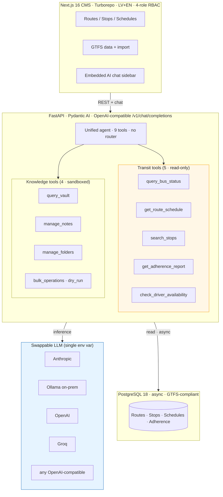

# VTV — Bartaševičs deck plan

## TL;DR

Five-slide deck framed around a single thesis: **Rīgas Satiksme has publicly admitted (April 2026) that its ticketing + payment stack is outdated and fragmented; the modernisation procurement window is open right now; VTV is the only Latvian-built, AI-agentic, GTFS-compliant, bilingual, sovereign-deployable option in front of the city.** The deck confirms the problem (S1), grounds it in the as-is (S2), shows the target architecture as a diagram (S3), walks the 12-month delivery journey (S4), and closes with a MECE decision matrix (S5) so Bartaševičs can defend the choice in Council.

Two warnings up-front:

1. **Bartaševičs's current portfolio is unconfirmed.** Public sources place him on the *Latvija pirmajā vietā* (LPV) Rīga list (son of Aleksandrs Bartaševičs, ex-Saskaņa veteran) but I could not find a public statement that he holds the transport / digital portfolio. Confirm role + committee assignment before pitching.
2. **No hard ROI number in v1.** MEMORY.md flags that the prior €2.4–4.4M VTV ROI claim needs one paid transit-CFO review before it goes public again. The deck uses qualitative cost-of-inaction language; the number stays out until validated.

---

## Application state — what VTV is today (source of truth: this VPS + repo README)

- **One unified Pydantic AI agent · 9 tools.** 5 read-only transit tools (`query_bus_status`, `get_route_schedule`, `search_stops`, `get_adherence_report`, `check_driver_availability`) + 4 Obsidian vault knowledge-management tools.
- **GTFS-compliant data layer.** Standard EU/global transit data model.
- **Next.js 16 CMS** (Turborepo monorepo, React 19, Tailwind v4, Auth.js v5 with 4-role RBAC, next-intl LV+EN, design tokens, shadcn/ui).
- **FastAPI backend** (Python 3.12, Pydantic AI 1.58, SQLAlchemy 2.0 async, PostgreSQL 18, Alembic migrations, asyncpg).
- **Swappable LLM provider** — env-var switch between Anthropic, Ollama (on-prem), OpenAI, Groq, OpenRouter, any OpenAI-compatible API. Optional fallback chain.
- **Safety constraints coded in.** Read-only transit tools, `confirm: true` on vault deletes, `dry_run` preview on bulk ops, path-traversal sandbox, monthly cloud-LLM spend cap.
- **Engineering discipline.** 75 tests in <1.2s, MyPy + Pyright strict, Ruff, Alembic migrations, OpenAPI-generated TypeScript SDK.
- **Single-agent / no-router architecture** — the LLM picks tools from one unified registry. Cleaner than multi-agent orchestration and an honest engineering choice that holds up under public-sector scrutiny.
- **Stage:** MVP complete, repo at `github.com/linardsb/VTV` (or local — push status to confirm before deck), no production deployment yet.

## Competition snapshot (May 2026, public sources)

| Vendor | Strength | Gap vs Riga's stated need |
|---|---|---|
| **Optibus** (IL/US, AI scheduling) | Modern AI scheduling, GTFS, multi-modal | Foreign IP, no LV-native UI, SaaS lock-in, no on-prem LLM |
| **GIRO HASTUS** (CA) | Industry standard for crew + vehicle scheduling | Heavy/legacy, expensive, English-first, no agentic AI |
| **Trapeze / Modaxo** (CA, owned by Volaris) | Integrated suite (sched + dispatch + real-time) | Foreign IP, Anglo-centric, multi-year integrations |
| **INIT MOBILE** (DE) | Strong EU footprint, ITxPT-aligned hardware + software | Hardware-tied, SaaS, no Latvian-language native, no on-prem AI |
| **Cubic Transportation Systems** (US) | Fare-collection + payment-system specialist | Massive scale, expensive, no agentic layer, foreign IP |
| **Routematch / Xerox BusPlan** | On-demand / paratransit | Wrong fit for fixed-route Rīga bus + tram |
| **In-house build by Rīgas Satiksme** | Full control | 24+ months, capital expense, no transit-AI staff today |

**The hole VTV fits:** Latvian-built, bilingual native, sovereign deploy option (Ollama on-prem), AI-agentic from day one, GTFS-compliant, modern stack, can ride alongside the just-announced payment-system market study (April 2026, `eng.lsm.lv/article/economy/transport/29.04.2026-...`) instead of competing with it.

---

## Slide 1 — Define the challenge (confirm understanding)

**Slide title:** *Rīga's transit stack — what we believe is the problem*

- Rīgas Satiksme publicly stated (April 2026) that its electronic payment system is outdated and that several unrelated ticketing systems run in parallel with limited development potential.
- The market study for a new payment system is open *now* — the window to shape requirements is Q2–Q3 2026, not after the procurement notice lands.
- Three pressures compound: EU GTFS-RT + open-data expectations, rider expectations (bank cards, mobile, QR), and a political demand for visible sovereignty in critical public infrastructure.
- Cost of inaction reads as continued vendor lock-in, foreign IP exposure, slower modernisation than peer EU capitals, and an opportunity cost on local AI-skills development.
- *Frame as a question, not a statement* — close the slide with: "Have I framed the problem the way the city sees it? What's missing?"

**Why this slide:** You cannot pitch a solution Bartaševičs has not first confirmed is the problem. This slide is a permission gate, not a sales slide.

## Slide 2 — As-is (current state, issues, costs)

**Slide title:** *Where the operations stack sits today*

- **Fragmentation:** multiple unconnected ticketing systems, no unified ops CMS, institutional knowledge stored in PDFs, Excel and tribal memory (per Rīgas Satiksme's own April 2026 statement).
- **Foreign-vendor dominance.** The current shortlist of modernisation vendors — Optibus, Trapeze, HASTUS, INIT, Cubic — all carry IP overseas, all are SaaS-priced in EUR/USD, none deliver native Latvian UI on day one.
- **No operational AI layer.** Drivers, dispatchers, and planners work without an AI co-pilot. Adherence questions, schedule lookups, and stop searches still cost analyst time.
- **Procurement timeline is the binding constraint.** A typical EU public-sector tender → award → integration runs 12–18 months. The decision quality of that tender is set in the next 90 days.
- **Cost of inaction (qualitative for v1).** Continued license + integration spend, no leverage on local AI-skills development, narrative loss vs Tallinn / Vilnius if they modernise first. *(Insert a hard € figure only after the transit-CFO review noted in MEMORY.md is done.)*

## Slide 3 — Future / best-in-class (solution blueprint)

**Slide title:** *VTV — unified CMS + AI agent for Riga transit operations*

- **Unified single-agent architecture** — one Pydantic AI agent, 9 tools, no orchestrator. The LLM picks tools; routing is data, not code. Easier to audit; cheaper to maintain.
- **Bilingual LV + EN CMS** with role-based access (driver / dispatcher / planner / admin), built on Next.js 16 + Auth.js v5.
- **GTFS-compliant data layer** — Riga's data stays in an EU-standard model; portable in and out, no proprietary lock-in.
- **Swappable LLM** — flip a single env var to run on Anthropic, OpenAI, Groq, OpenRouter, or fully on-prem on Ollama. Sovereign-deploy option is real, not aspirational.
- **Safety guardrails coded in** — transit tools read-only, vault deletes need explicit confirmation, bulk ops support dry-run preview, path-traversal sandbox, monthly LLM-spend cap. The "agentic but won't burn the building down" answer to the procurement risk question.

## Slide 4 — How we get there (journey overview)

**Slide title:** *From signed Phase-0 to operational hand-off — 12 months*

- **Phase 0 · Discovery sprint · Weeks 0–4.** 5 stakeholder interviews (Rīgas Satiksme ops, dispatch, planning, audit, Council digital lead), read-only sandbox connection to Riga's public GTFS feed, agreed success metrics + kill-switch criteria, fixed-price.
- **Phase 1 · Pilot · Months 2–4.** 2 routes, 1 depot, AI agent shadow-mode for one dispatcher, weekly review with ops. Decision gate at end of Phase 1: continue / pause / pivot.
- **Phase 2 · Scale · Months 5–8.** Full route network on the CMS, RBAC live for ops staff, optional integration with the new payment-system procurement winner (architecture supports this; we are not the payment-system vendor).
- **Phase 3 · Hand-off · Months 9–12.** Knowledge transfer to RS staff, EU GTFS-RT audit pass, source-code escrow option for the city, post-hand-off retainer for tier-2 support.
- **Governance throughout.** Bi-weekly Council steering review, GDPR + IP review at each phase gate, kill-switch at any gate if KPI thresholds (defined in Phase 0) are not met. *Politically safe by design — no irreversible commitments before Phase-0 evidence.*

## Slide 5 — MECE: how Bartaševičs should choose

**Slide title:** *The decision space, decomposed (MECE)*

> Mutually exclusive, collectively exhaustive — every realistic modernisation path Riga could take, evaluated on the four criteria the Council will be asked about.

| Path | Speed | Cost | IP / sovereignty | LV-language native | Political narrative |
|---|---|---|---|---|---|
| **A · Build in-house at RS** | ✗ 24+ mo | ✗ High capex | ✓ Full | ✓ | ~ Mixed |
| **B · Foreign SaaS** (Optibus / Trapeze / HASTUS / INIT) | ✓ Fast deploy | ✗ Recurring license, EUR/USD | ✗ Foreign | ✗ Bolt-on | ✗ "Riga depends on foreign tech" |
| **C · Regional EU integrator** (e.g. SI/PL/CZ) | ~ 12–18 mo | ~ Mid | ~ Partial | ✗ | ~ Neutral |
| **D · Latvian-built specialist (VTV)** | ✓ Phase 0 in 4 wks | ✓ Modular, milestone-priced | ✓ Latvia + escrow | ✓ Native | ✓ "Riga backs Latvian talent" |

- **A — Build in-house.** Politically clean but slow and capital-heavy; RS does not have transit-AI staff today.
- **B — Foreign SaaS.** Fast and proven, but every euro spent leaves Latvia and the city becomes a tenant on someone else's roadmap.
- **C — Regional EU integrator.** Reasonable middle, but no Latvian-language depth and limited AI-agentic experience at the operations layer.
- **D — Latvian-built specialist (VTV).** Speed of B, sovereignty of A, with a Latvian-language native UX and on-prem AI option. Fits the political narrative without depending on it.
- **Recommended path:** D, sequenced behind a fixed-price Phase-0 discovery sprint. Phase-0 carries near-zero political risk and gives Bartaševičs evidence to defend the choice in Council.

> **Note:** This MECE deliberately frames the *partner-choice* decision, not the *operational-problem* decomposition. If Bartaševičs reframes the meeting around "what are the operational gaps", a second MECE tree (Demand-side / Supply-side / Decision-side / Compliance-side / Workforce-side) is on standby in speaker notes.

## Slide 6 (optional) — The ask

**Slide title:** *What I am asking for today*

- Greenlight a 4-week, fixed-price Phase-0 discovery sprint (price + statement of work attached as appendix).
- One named contact at Rīgas Satiksme ops + one at Council digital portfolio.
- Read-only access to the public GTFS feed (already public — formal acknowledgement only).
- A 30-minute Phase-0 review meeting in week 4 to decide go / no-go for Phase 1.
- A short Council statement of intent if Phase-0 evidence supports it — frames the political narrative around Latvian transit talent without committing the city to procurement.

---

## Speaker-note guidance (per slide, ≤2 lines)

- **S1.** Open with the April 2026 RS quote. Do not name vendors. Ask the confirmation question before turning the page.
- **S2.** Stay quantitative on the *fragmentation* claim (RS own statement) and qualitative on cost. Do not put € figures on the slide.
- **S3.** Diagram first, words second. The single-agent / 9-tools / swappable-LLM story is the differentiator — say it slowly.
- **S4.** Anchor on Phase-0. Phase-0 is the only commitment being asked for today. Everything after is gated.
- **S5.** The MECE table is the slide. Read down the right-hand column. Stop on path D and ask: "Anything missing from this decomposition?"
- **S6.** End on the smallest possible ask. Phase-0 SoW is in the appendix.

## Visual / brand notes

- Use the Saulera design system tokens (`saulera-design-system.md`): Amber `#F59E0B` for accents, Iron Grey `#5A5A5A` for body, no gradients, 0px border-radius across the deck, asymmetric-disc motif on the title slide.
- Typography: Homizio for display + buttons, Montserrat Ace 300/400/500 for body.
- One diagram per slide max. Slide 3 carries the Mermaid blueprint above; the others are bullets + a single supporting visual.
- LV translation: deliver in EN for Bartaševičs but keep an LV alternate of S1 + S5 for Council circulation.

## Open questions (decide before the deck is built)

1. **Bartaševičs's current role.** Confirm portfolio, committee, and decision-rights before pitching. If he is not transport- or digital-portfolio, S6 ask changes from "greenlight Phase 0" to "introduce me to the right Council member".
2. **VTV repo public status.** README references `github.com/linardsb/VTV` — confirm public before the deck is shared (the procurement narrative weakens if the repo is private at meeting time).
3. **Hard € figures on S2.** Run the transit-CFO review (per MEMORY.md) before any number lands on a slide.
4. **LPV framing.** Bartaševičs is on the LPV list. SOUL.md says no politics in agent output, and MEMORY.md says LPV is an accelerator not a foundation — keep the deck politically neutral; the warm-channel intro happens off-slide.
5. **Saulera vs personal brand on the cover.** Saulera-branded if positioned as Linards's consultancy, personal-name if positioned as an individual operator pitch — choose one before design.

## Build path (what happens next)

This is the **plan**. Building the actual `.pptx` requires the `content-artifacts` skill, which is **not in scope for this channel** (#vtv channel scope blocks it). Two options:

- **Option A (recommended):** DM me on a channel where `content-artifacts` is in scope. I'll generate the `.pptx` from this plan in one pass (Saulera tokens, the Mermaid diagram on S3 rendered to a PNG, speaker notes embedded).
- **Option B:** Hand this `.md` plan to a designer (Figma / Keynote / PowerPoint) to render — the structure and copy are deck-ready as-is.

## Sources

- [Make Riga Great Again? The Latvian Municipal Election Race — GSSC, June 2025](https://www.gssc.lt/en/publication/make-riga-great-again/) — for Bartaševičs's LPV list placement
- [Rīga needs a new public transport payment system — LSM, 29 April 2026](https://eng.lsm.lv/article/economy/transport/29.04.2026-riga-needs-a-new-public-transport-payment-system.a645047/) — RS market-study quote (S1, S2)
- [Rīgas satiksme procurements page](https://www.rigassatiksme.lv/en/about-us/procurements/) — live tender index
- [MECE framework — MBA Crystal Ball](https://www.mbacrystalball.com/blog/strategy/mece-framework/) — S5 framing reference
- [Top 10 Optibus Alternatives — G2, 2026](https://www.g2.com/products/optibus/competitors/alternatives) — competition table
- [Top 10 HASTUS Alternatives — G2, 2026](https://www.g2.com/products/hastus/competitors/alternatives)
- [Rīgas Satiksme — Wikipedia](https://en.wikipedia.org/wiki/R%C4%ABgas_Satiksme) — RS scope + history
- [VTV README (this VPS, ideation transcript 2026-05-04)](../../../ideation/2026-05-04_1777924176.178239_hey-im-about-to-build-a-website-for-my-b.md)

## Cross-references inside the vault

- `Fredis/Memory/MEMORY.md` — VTV sequencing ("ships first"), LPV-channel rule, ROI-claim guard
- `Fredis/Memory/drafts/active/brand/saulera-design-system.md` — visual tokens (Amber, Iron Grey, 0px-radius, no gradients, Homizio + Montserrat Ace)
- `Fredis/Memory/drafts/active/brand/saulera-website-plan-v1.md` — VTV Results-page card, same architecture diagram
- `Fredis/Memory/collaborators/_network.md` — LPV warm contacts (Šlesers / Krištopans), should not be named in the deck itself
